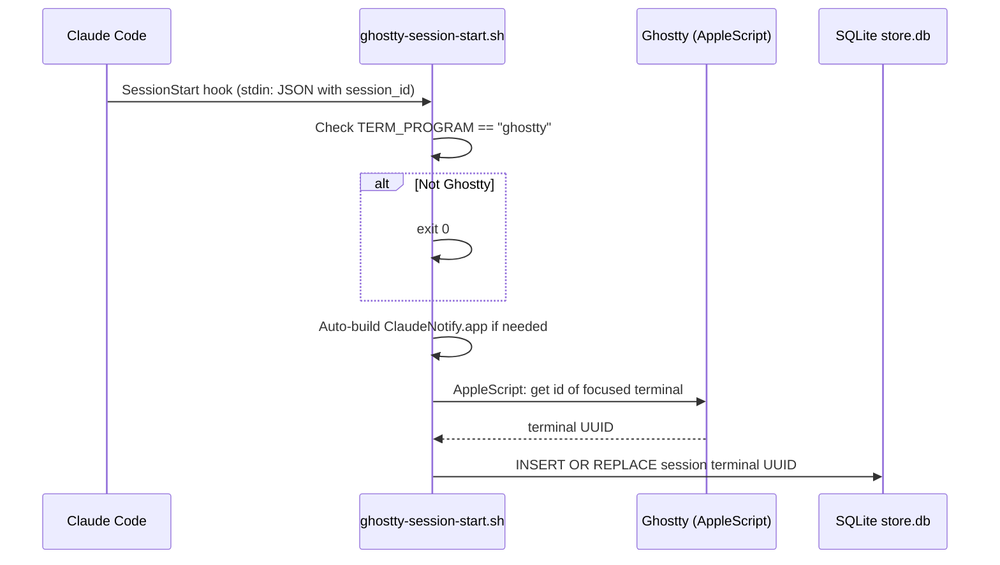
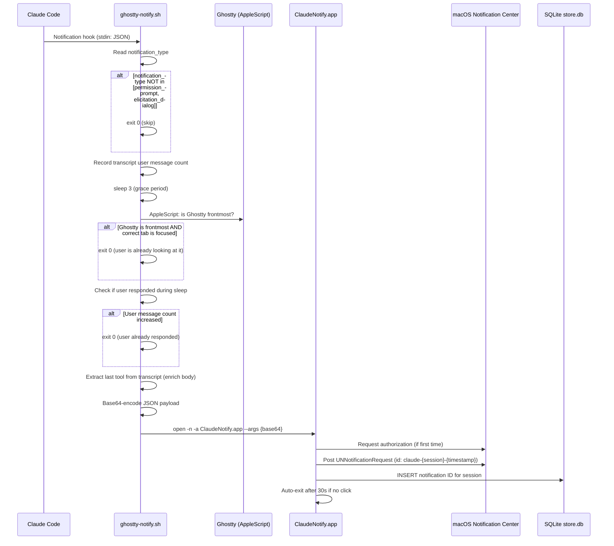
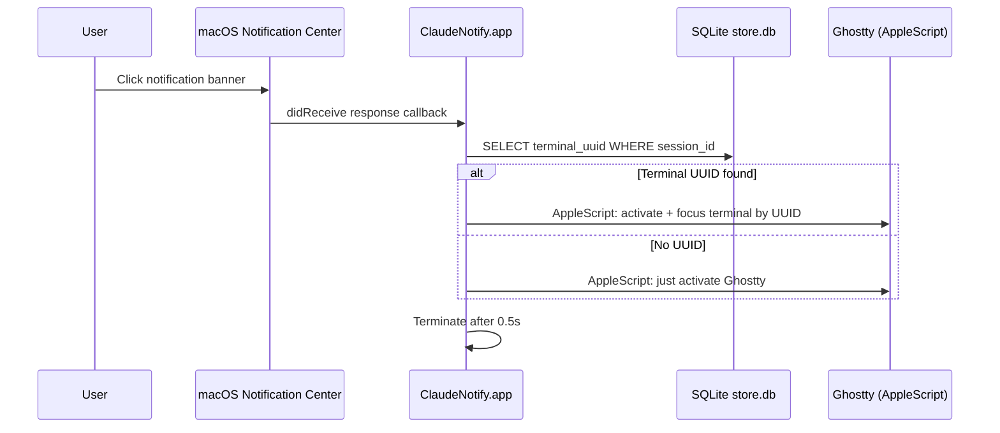
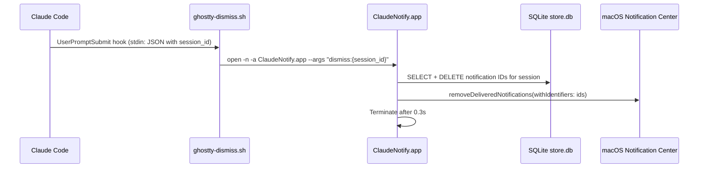

# Notification Flows

This document codifies exactly when and how notifications fire, dismiss, and focus.

## Hooks Registered

| Hook Event | Script | Async | Timeout |
|---|---|---|---|
| `Notification` | `ghostty-notify.sh` | yes | 30s |
| `SessionStart` | `ghostty-session-start.sh` | no | 5s |
| `UserPromptSubmit` | `ghostty-dismiss.sh` | yes | 5s |

## Notification Types (from Claude Code)

| `notification_type` | Action | Reason |
|---|---|---|
| `permission_prompt` | **NOTIFY** | Claude needs permission — user must act |
| `elicitation_dialog` | **NOTIFY** | Claude is showing an input dialog — user must act |
| `idle_prompt` | **SKIP** | Fires on task complete AND genuine idle — too many false positives |
| `auth_success` | **SKIP** | Informational only, no action needed |
| (empty/other) | **SKIP** | Unknown or non-actionable |

## Flow 1: Session Start

Captures the Ghostty terminal UUID so notifications can focus the correct tab when clicked.



## Flow 2: Notification (Permission Prompt / Elicitation Dialog)



## Flow 3: Notification Click (Focus Ghostty Tab)



## Flow 4: Dismiss on User Prompt Submit



## Suppression Logic (ghostty-notify.sh)

Notifications are suppressed when ANY of these conditions are true:

1. **Wrong type**: `notification_type` is not `permission_prompt` or `elicitation_dialog`
2. **User is looking**: Ghostty is frontmost AND the active tab matches this session's terminal UUID
3. **User already responded**: User message count in transcript increased during the 3s delay

## Storage: SQLite Database

All persistent state is in `~/Library/Application Support/com.claude.notify/store.db`.

Both the Swift app and shell scripts (via `sqlite3` CLI) share this database.
Entries older than 24 hours are auto-purged on every access.

### Schema

```sql
-- Terminal UUID per session (for click-to-focus)
CREATE TABLE sessions (
    session_id TEXT PRIMARY KEY,
    terminal_uuid TEXT,
    updated_at REAL DEFAULT (strftime('%s','now'))
);

-- Posted notification IDs per session (for dismiss)
CREATE TABLE notifications (
    notif_id TEXT PRIMARY KEY,
    session_id TEXT NOT NULL,
    created_at REAL DEFAULT (strftime('%s','now'))
);
```

### Access Pattern

| Operation | Writer | Reader |
|---|---|---|
| Store terminal UUID | `ghostty-session-start.sh` (sqlite3 CLI) | `ghostty-notify.sh` (sqlite3 CLI), `ClaudeNotify.swift` (click handler) |
| Store notification ID | `ClaudeNotify.swift` (after posting) | `ClaudeNotify.swift` (dismiss mode) |
| Purge old entries | Both (on every access) | — |

## Running Tests

```bash
# Build then run inline tests (uses in-memory SQLite, no side effects)
bash install.sh
./build/ClaudeNotify.app/Contents/MacOS/ClaudeNotify --test
```
